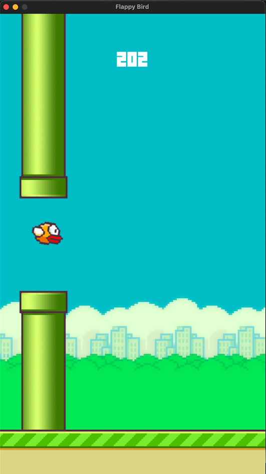

AI learns to play Flappy Bird
========================================

Introduction
------------
Flappy Bird was one of the most frustrating and addicting game ever created, the feeling when the bird dies has always been annoying to deal with. So I thought 
why not created an AI to play the game for me and never die. In this project I used one of the most successful reinforcement learning algorithms called 
NeuroEvolution of Augmenting Topologies aka NEAT to train an AI to play the game flawlessly.

Installing Packages
-------------------
Packages used:

```python
import neat
import pygame
```

Installing package, run:

```terminal
pip install neat-python, pygame
```

Run Script
----------
There are 2 scripts that can be run, FlappyBirdGame.py and AIFlappyBird.py

To run the Flappy Bird game for you to play: 

```
python FlappyBirdGame.py
```

To run the AI version: 

```
python AIFlappyBird.py
```

What is NEAT?
-------------
Neat is an evolutionary algorithm. It first initialises different artificial neural networks to run the simulation. In this case it runs Flappy Bird with a lot of
different birds. Once the simulation starts running, each bird gets a certain feedback depending on how its doing, if it is doing well aka it passes some pipes,
we give it some positive feedback, if it doesn't do well and dies, we want to give it some negative feedback or a feedback that is less positive than the others. 
After running the simulation and all the birds die, NEAT picks out the bird with the best fitness aka the bird with the best feedback and makes a sub evolution 
set based off of that bird and runs the simulation again with the new birds. 

For more information: Click [here](https://neat-python.readthedocs.io/en/latest/neat_overview.html)

Results
-------
After training the AI, it successfully plays Flappy Bird without dying, here is an example of how far the AI got. You can also look at the generations used in the
Results.txt file




